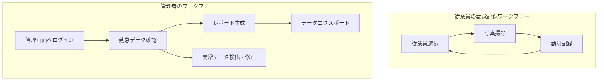
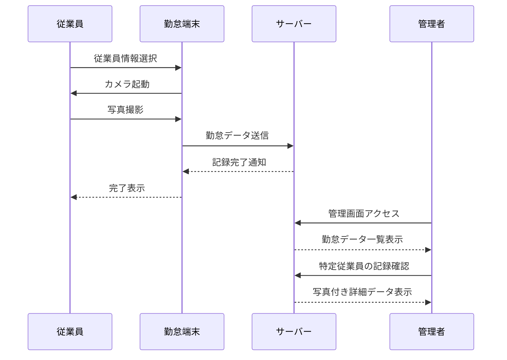

# 勤怠管理システム - ビジネス要件

## 1. プロジェクトの目的

勤怠管理システムは、従業員の勤務時間を正確に記録・管理することで業務効率化を図るためのシステムです。特に本システムでは、写真撮影による本人確認を必須機能として実装することで、なりすましや代理打刻などの不正行為を防止し、より厳格な勤怠管理を実現します。

## 2. システム概要

本システムは、特定の固定ターミナル（端末）に設置される勤怠記録用アプリケーションです。従来の勤怠システムとは異なり、ユーザー個人によるログイン・ログアウト機能は設けず、組織内の決められた場所に設置された専用端末から勤怠情報を記録する方式を採用します。

システム構成としては、下記の2つの主要画面から成ります：

### ワークフロー図

## 3. 主要機能要件

### 機能概要一覧

| 機能区分 | 機能名 | 概要 | 利用者 |
|---------|-------|------|-------|
| 勤怠記録 | 従業員選択 | 自分の名前を一覧から選択する | 従業員 |
| 勤怠記録 | 写真撮影 | 本人確認のための写真を撮影する | 従業員 |
| 勤怠記録 | 勤怠種別選択 | 出勤・退勤・休憩開始・休憩終了を選択 | 従業員 |
| 勤怠記録 | 記録完了 | タイムスタンプと写真を紐付けて記録 | システム |
| 勤怠管理 | リアルタイム状況 | 現在の出勤状況をリアルタイムで表示 | 管理者 |
| 勤怠管理 | 履歴データ閲覧 | 過去の勤怠記録の閲覧と写真確認 | 管理者 |
| 勤怠管理 | 異常データ検出 | 未退勤などの異常データを自動検出 | 管理者 |
| 勤怠管理 | データ修正 | 異常データの手動修正機能 | 管理者 |
| レポート | 個人別集計 | 従業員ごとの勤務実績レポート | 管理者 |
| レポート | 部署別集計 | 部署ごとの勤務時間集計 | 管理者 |
| レポート | データエクスポート | CSV形式などで外部出力 | 管理者 |
| システム | セキュリティ管理 | 管理画面へのアクセス制限 | 管理者 |

### 3.1 勤怠記録機能

勤怠記録機能は本システムの中核となる機能です。従業員がチェックイン（出勤）・チェックアウト（退勤）を行う際には、必ず写真撮影が実施され、その記録と共に勤務情報が保存されます。これにより、誰が実際に勤怠登録を行ったかを視覚的に確認することが可能となります。

写真撮影プロセスは次のように進行します：
1. 従業員が端末で自分の名前を選択
2. 勤怠タイプ（出勤・退勤・休憩開始・休憩終了）を選択
3. カメラが起動し、従業員の顔写真を撮影
4. 撮影した写真を確認し、送信または再撮影
5. 送信後、システムは自動的にタイムスタンプと写真を紐付けて記録

このプロセスにより、「いつ」「誰が」「どのような勤怠アクションを行ったか」を確実に記録することができます。

### 3.2 勤怠閲覧・管理機能

管理者向けの画面では、すべての従業員の勤怠履歴を閲覧・管理することができます。写真付きの勤怠記録により、管理者は視覚的に従業員の出退勤状況を確認できます。また、月次の勤務実績集計や残業時間の自動計算機能も実装されています。

特筆すべき点として、同日に出勤登録のみで退勤記録がないなどの異常データを自動的に検出し、フラグ付けする機能を備えています。これにより、勤怠データの抜け漏れを防ぎ、正確な労働時間管理を実現します。

### 3.3 レポート機能

レポート機能では、蓄積された勤怠データを様々な角度から分析・出力することが可能です。個人別の勤務実績レポートや部署別の集計、残業時間レポートなどを自動生成し、人事管理業務をサポートします。

また、データのエクスポート機能を備えており、CSV形式などで外部システムとの連携も容易に行えます。

## 4. ユーザー区分と利用シナリオ

本システムには主に2種類のユーザーが存在します：

| ユーザー区分 | 主な権限 | 利用シナリオ |
|------------|--------|------------|
| 一般従業員 | 勤怠記録のみ | 出社時に端末で自分を選択して写真撮影→出勤記録 退社時に端末で自分を選択して写真撮影→退勤記録 休憩時も同様のフローで記録 |
| 管理者 | 全機能利用可能 | 日々の出勤状況確認 月末の勤怠集計レポート作成 異常データの検出と修正 写真確認による本人確認 |

一般従業員は専用端末に設置された勤怠記録用画面を通じて、自身の勤怠情報を記録するのみです。一方、管理者（人事部門など）は管理用画面にアクセスして、すべての従業員の勤怠データを閲覧・管理することができます。

典型的な利用フローは次のとおりです：

この設計により、シンプルかつ堅牢な勤怠管理を実現し、組織の労務管理を効率化します。 