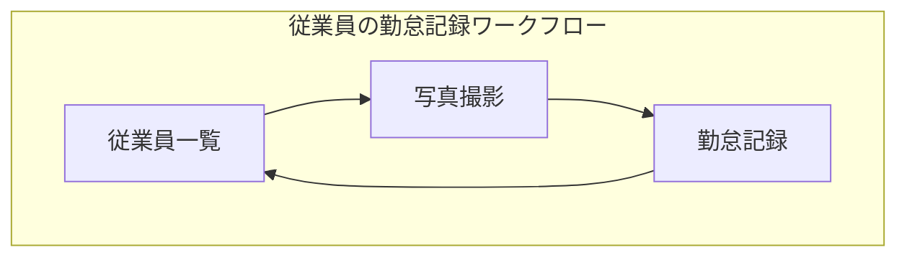
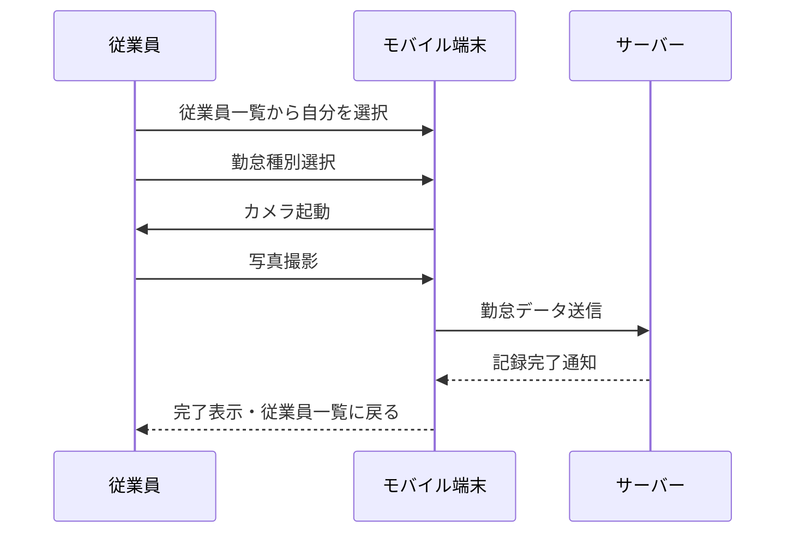

# 勤怠管理システム - ビジネス要件

## 1. プロジェクトの目的

勤怠管理システムは、従業員の勤務時間を正確に記録・管理することで業務効率化を図るためのモバイルアプリケーションです。特に本システムでは、写真撮影による本人確認を必須機能として実装することで、なりすましや代理打刻などの不正行為を防止し、より厳格な勤怠管理を実現します。

## 2. システム概要

本システムは、各拠点に設置された共有のモバイル端末で利用する勤怠記録用アプリケーションです。特定の従業員の端末ではなく、オフィスの入口などに固定設置されたタブレットやスマートフォンなどから、誰でも勤怠情報を記録できる仕組みとなっています。これらのデータはWeb APIを介してサーバーに保存されます。

システム構成としては、下記の主要画面から成ります：

### ワークフロー図

## 3. 主要機能要件

### 機能概要一覧

| 機能区分 | 機能名 | 概要 | 利用者 |
|---------|-------|------|-------|
| 従業員選択 | 一覧表示 | 所属従業員の一覧から自分を選択 | 従業員 |
| 勤怠記録 | 写真撮影 | 本人確認のための写真を撮影する | 従業員 |
| 勤怠記録 | 勤怠種別選択 | 出勤・退勤・休憩開始・休憩終了を選択 | 従業員 |
| 勤怠記録 | 記録完了 | タイムスタンプと写真を紐付けて記録 | システム |
| 設定 | 端末設定 | 拠点設定や同期設定など | 管理者 |

### 3.1 勤怠記録機能

勤怠記録機能は本システムの中核となる機能です。従業員がチェックイン（出勤）・チェックアウト（退勤）を行う際には、必ず写真撮影が実施され、その記録と共に勤務情報が保存されます。これにより、誰が実際に勤怠登録を行ったかを視覚的に確認することが可能となります。

写真撮影プロセスは次のように進行します：
1. 従業員が端末で自分の名前を一覧から選択
2. 勤怠タイプ（出勤・退勤・休憩開始・休憩終了）を選択
3. カメラが起動し、従業員の顔写真を撮影
4. 撮影した写真を確認し、送信または再撮影
5. 送信後、システムは自動的にタイムスタンプと写真を紐付けて記録
6. 記録完了後、従業員選択画面に戻る

このプロセスにより、「いつ」「誰が」「どのような勤怠アクションを行ったか」を確実に記録することができます。

### 3.2 従業員選択機能

アプリケーションの初期画面では、拠点に所属する従業員の一覧が表示されます。従業員は一覧から自分を選択することで勤怠記録プロセスを開始できます。

従業員一覧は以下の特徴を持ちます：
- 氏名とともに顔写真を表示し、視覚的に選択しやすくする
- 検索機能により、従業員数が多い場合も素早く自分を見つけられる
- 最近の利用履歴から、頻繁に利用する従業員を上部に表示する機能

### 3.3 オフライン対応

インターネット接続が一時的に利用できない環境でも勤怠記録を可能にするため、オフラインモードを実装します。オフライン時に記録した勤怠データは、インターネット接続が回復した際に自動的にサーバーと同期されます。

## 4. ユーザー区分と利用シナリオ

本システムには主に2種類のユーザーが存在します：

| ユーザー区分 | 主な権限 | 利用シナリオ |
|------------|--------|------------|
| 従業員 | 勤怠記録のみ | 出社時に端末で自分を選択して写真撮影→出勤記録 退社時に端末で自分を選択して写真撮影→退勤記録 休憩時も同様のフローで記録 |
| 管理者 | 端末設定 | 端末の初期設定 同期状態の確認 端末のメンテナンス |

典型的な利用フローは次のとおりです：

この設計により、複数の従業員が一台の端末を共有して利用できる勤怠管理アプリケーションを実現し、拠点ごとの勤怠管理を効率化します。 