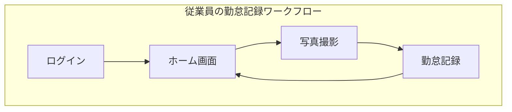
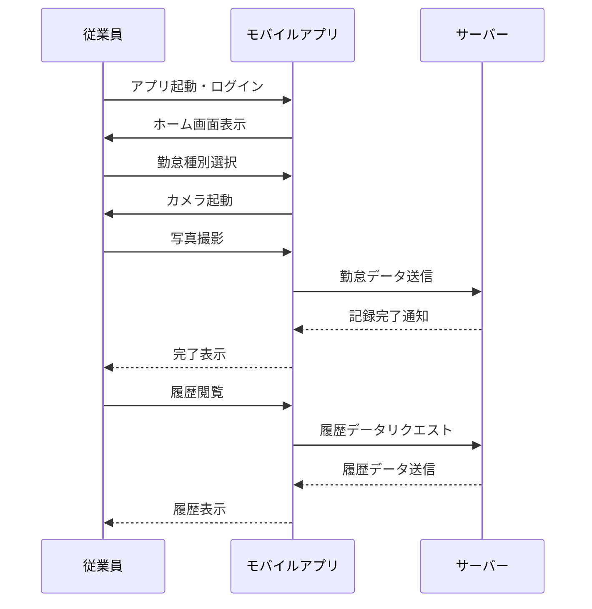

# 勤怠管理システム - ビジネス要件

## 1. プロジェクトの目的

勤怠管理システムは、従業員の勤務時間を正確に記録・管理することで業務効率化を図るためのモバイルアプリケーションです。特に本システムでは、写真撮影による本人確認を必須機能として実装することで、なりすましや代理打刻などの不正行為を防止し、より厳格な勤怠管理を実現します。

## 2. システム概要

本システムは、従業員個人のスマートフォンにインストールして使用する勤怠記録用モバイルアプリケーションです。従業員は自身のスマートフォンから勤怠情報を記録し、それらのデータはWeb APIを介してサーバーに保存されます。

システム構成としては、下記の主要画面から成ります：

### ワークフロー図

## 3. 主要機能要件

### 機能概要一覧

| 機能区分 | 機能名 | 概要 | 利用者 |
|---------|-------|------|-------|
| 認証 | ログイン | 従業員IDとパスワードでログイン | 従業員 |
| 勤怠記録 | 写真撮影 | 本人確認のための写真を撮影する | 従業員 |
| 勤怠記録 | 勤怠種別選択 | 出勤・退勤・休憩開始・休憩終了を選択 | 従業員 |
| 勤怠記録 | 記録完了 | タイムスタンプと写真を紐付けて記録 | システム |
| 勤怠閲覧 | 履歴表示 | 自分の過去の勤怠記録を閲覧 | 従業員 |
| プロフィール | 情報表示 | 自分のプロフィール情報を表示 | 従業員 |
| 設定 | アプリ設定 | 通知設定やテーマ変更など | 従業員 |

### 3.1 勤怠記録機能

勤怠記録機能は本システムの中核となる機能です。従業員がチェックイン（出勤）・チェックアウト（退勤）を行う際には、必ず写真撮影が実施され、その記録と共に勤務情報が保存されます。これにより、誰が実際に勤怠登録を行ったかを視覚的に確認することが可能となります。

写真撮影プロセスは次のように進行します：
1. 従業員がアプリにログイン
2. ホーム画面から勤怠タイプ（出勤・退勤・休憩開始・休憩終了）を選択
3. カメラが起動し、従業員の顔写真を撮影
4. 撮影した写真を確認し、送信または再撮影
5. 送信後、システムは自動的にタイムスタンプと写真を紐付けて記録
6. 記録完了後、ホーム画面に戻る

このプロセスにより、「いつ」「誰が」「どのような勤怠アクションを行ったか」を確実に記録することができます。

### 3.2 勤怠履歴閲覧機能

従業員は自身の勤怠履歴を閲覧することができます。日別、週別、月別での表示が可能で、出退勤時間や労働時間の合計なども確認できます。これにより、自身の勤務状況を把握し、適切な勤務管理を行うことができます。

### 3.3 オフライン対応

インターネット接続が一時的に利用できない環境でも勤怠記録を可能にするため、オフラインモードを実装します。オフライン時に記録した勤怠データは、インターネット接続が回復した際に自動的にサーバーと同期されます。

## 4. ユーザー区分と利用シナリオ

本システムのユーザーは従業員のみとなります：

| ユーザー区分 | 主な権限 | 利用シナリオ |
|------------|--------|------------|
| 従業員 | 全機能利用可能 | 出社時にアプリで写真撮影→出勤記録 退社時にアプリで写真撮影→退勤記録 休憩時も同様のフローで記録 自身の勤怠履歴の閲覧 |

典型的な利用フローは次のとおりです：

この設計により、いつでもどこでも簡単に勤怠記録が行えるモバイルアプリケーションを実現し、従業員の勤怠管理を効率化します。 