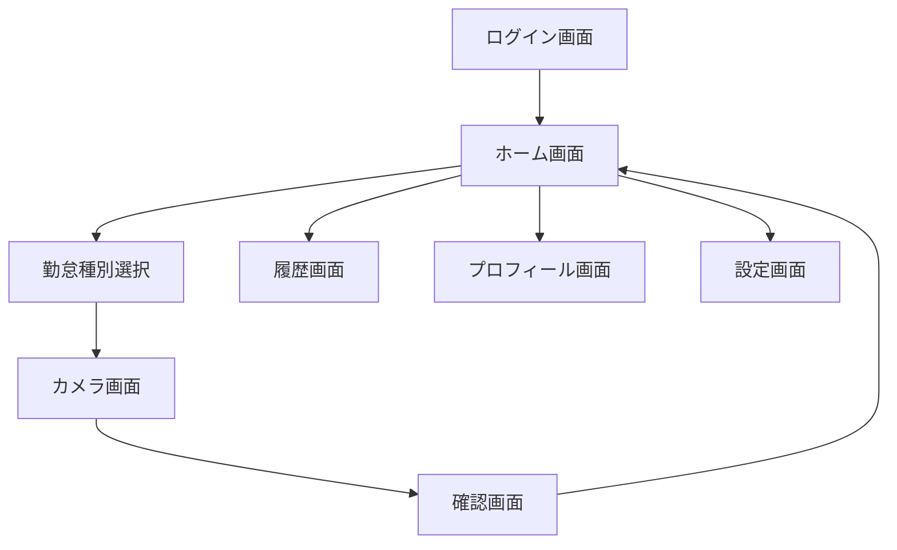

# 勤怠管理システム - デザインレイアウト

## 1. デザインシステム

本システムのデザインはGoogle提供のMaterial Design 3（Material You）を基調とし、動的なカラーシステム、形状変化、アニメーションなどを活用します。特に個人設定を反映するパーソナライズ機能を取り入れることで、ユーザーにとって使いやすく親しみやすいインターフェースを実現します。

### カラーパレット

Material Design 3の動的カラーシステムを採用し、ユーザーのデバイス壁紙から抽出されたカラースキームを反映させることも可能にします。基本的には以下のカラースキームを採用します。

#### メインカラー
- **プライマリ**: `#6750A4`  - アクションやボタン、重要な要素
- **オンプライマリ**: `#FFFFFF`  - プライマリ色上のテキストやアイコン
- **プライマリコンテナ**: `#EADDFF`  - プライマリ色を含むコンテナ

#### サブカラー
- **セカンダリ**: `#625B71`  - 補助的なアクション
- **サーフェス**: `#FFFBFE`  - カード背景などのサーフェス

#### アクセントカラー
- **成功緑**: `#146C2E`  - 完了、成功通知
- **警告オレンジ**: `#B86E00`  - 警告、注意喚起
- **エラー赤**: `#B3261E`  - エラー、重要警告

### タイポグラフィ設計

Material Design 3のタイポグラフィスケールを採用し、明確な視覚階層を形成します。

- 基本フォント: 'Roboto', 'Noto Sans JP'
- ヘッドライン大: 24sp, Medium
- ヘッドライン中: 20sp, Medium
- ヘッドライン小: 16sp, Medium
- 本文: 14sp, Regular
- ラベル: 12sp, Medium

### 主要コンポーネント設計

Material Design 3の新しいコンポーネントを活用し、モバイル向けに最適化します。

| コンポーネント | Material Design 3の特性 | 使用場面 |
|-------------|----------------------|--------|
| Card | 角丸、シャドウ効果、リップル効果 | 出退勤状況表示、履歴項目 |
| FAB (Floating Action Button) | 拡張FAB、色と形状の変化 | 勤怠記録開始 |
| Bottom Navigation Bar | アイコン+ラベル、選択時の視覚効果 | アプリ内ナビゲーション |
| Chips | フィルタリング、インタラクティブな状態表示 | 勤怠種別選択 |
| Dialog | フルスクリーンダイアログ | 写真確認、確認メッセージ |
| Top App Bar | スクロール時の動的サイズ変更 | ページヘッダー |

## 2. 画面構成と遷移フロー

モバイルアプリ特有のナビゲーションパターンを採用し、直感的な操作フローを実現します。

### 従業員の勤怠記録ワークフロー

## 3. 主要画面のデザイン

### ログイン画面

- 中央配置のロゴとアプリ名
- 従業員ID入力フィールド（テキストフィールド）
- パスワード入力フィールド（パスワードフィールド）
- ログインボタン（広いタッチエリアの主要ボタン）
- 生体認証オプション（指紋/顔認証アイコン）
- パスワードを忘れた場合のテキストリンク

### ホーム画面

- トップバー：ユーザー名と現在日時
- 現在の勤務状態表示カード
  - 大きなステータス表示（出勤中、退勤中など）
  - 最終アクション時刻
- 勤怠記録アクションボタン
  - 出勤ボタン（勤務状態に応じて表示/非表示）
  - 退勤ボタン（勤務状態に応じて表示/非表示）
  - 休憩開始/終了ボタン（勤務状態に応じて表示/非表示）
- 今日の勤務サマリーカード
  - 出勤時間
  - 現在の労働時間（出勤中の場合）
  - 休憩時間合計
- 拡張FAB：主要なアクション用（状況に応じて変化）
- ボトムナビゲーションバー：ホーム、履歴、プロフィール、設定

### カメラ画面

- フルスクリーンのカメラビューファインダー
- 上部：アクション種別表示（出勤・退勤・休憩など）
- 下部：シャッターボタン（大きな円形ボタン）
- キャンセルボタン（左下）
- カメラ切替ボタン（フロント/バック）
- フラッシュ制御ボタン

### 写真確認画面

- 撮影した写真表示（中央大きく）
- 「この写真を使用しますか？」テキスト
- 確認ボタン（主要アクション）
- 再撮影ボタン（セカンダリアクション）
- キャンセルボタン（テキストリンク）

### 勤怠履歴画面

- フィルタリングオプション
  - 日別/週別/月別切替タブ
  - 日付範囲選択オプション
- 履歴リスト
  - 日付区切り見出し
  - 各勤怠記録カード
    - 時刻
    - アクション種別（出勤/退勤など）
    - サムネイル写真（タップで拡大表示）
- エクスポートオプション（個人用CSV出力）

### プロフィール画面

- ユーザープロフィール画像（円形）
- 名前、従業員ID
- 所属部署
- 勤務情報
  - 勤務形態
  - 標準労働時間
- 連絡先情報
- パスワード変更オプション

### 設定画面

- 通知設定
  - 勤務開始/終了時のリマインダー
  - 未記録アラート
- テーマ設定
  - ライト/ダークモード切替
  - システムデフォルト
- バイオメトリック認証設定
- オフラインモード設定
- データ同期オプション
- ログアウトボタン
- バージョン情報

## 4. レスポンシブデザイン戦略

Flutter の柔軟なウィジェットシステムとレスポンシブフレームワークを活用して、さまざまな画面サイズに対応します。

### 画面サイズ別最適化

- **スマートフォン (縦向き)**
  - シングルカラムレイアウト
  - ボトムナビゲーション
  - スクロール重視の情報表示

- **スマートフォン (横向き)**
  - 二分割レイアウト（必要に応じて）
  - コンテンツ密度の最適化
  - ナビゲーション位置調整

- **タブレット**
  - マルチカラムレイアウト
  - サイドナビゲーションオプション
  - 情報密度の向上

### 適応技術

- MediaQuery を使用した画面サイズ検出
- LayoutBuilder によるレスポンシブレイアウト
- flutter_screenutil によるサイズスケーリング
- Flex と Expanded ウィジェットの活用

## 5. アニメーションとインタラクション設計

Material Design 3 の自然で滑らかなアニメーションを実装し、操作感を向上させます。

### 主要アニメーション

- **画面遷移**
  - Hero アニメーション（写真など）
  - 共有軸変換（シームレスなページ移動）
  - フェードスルー効果

- **フィードバックアニメーション**
  - リップルエフェクト（タップ反応）
  - スケール変化（ボタンプレス効果）
  - カラー変化（状態表示）

- **機能アニメーション**
  - プログレスインジケーター（送信中、同期中）
  - パルスアニメーション（注目喚起）
  - スライドイン通知

### インタラクションデザイン原則

- **直接操作**：スワイプ、タップなどの直感的なジェスチャー
- **視覚的フィードバック**：全ての操作に対する明確な反応
- **予測可能性**：一貫したパターンによる学習曲線の低減
- **効率性**：最小限のステップで目的を達成できるフロー

## 6. アクセシビリティへの配慮

すべてのユーザーが利用できるよう、アクセシビリティを重視したデザインを実装します。

- **十分なコントラスト比**: WCAG AAA基準に準拠したテキスト表示
- **スケーラブルなテキスト**: 文字サイズ変更に対応するレイアウト
- **音声アシスタント対応**: TalkBackやVoiceOverでの操作サポート
- **タッチターゲットサイズ**: 最小48dpの十分なタッチ領域確保
- **簡潔な操作フロー**: 複雑な操作を回避した単純なタスク設計
- **色だけに依存しない情報伝達**: アイコンやテキストの併用

この設計方針により、ユーザーフレンドリーで機能的なモバイル勤怠管理アプリを実現します。 