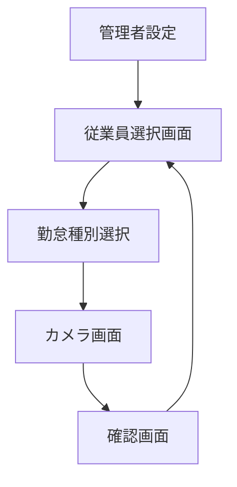

# 勤怠管理システム - デザインレイアウト

## 1. デザインシステム

本システムのデザインはGoogle提供のMaterial Design 3（Material You）を基調とし、動的なカラーシステム、形状変化、アニメーションなどを活用します。特に共有端末での使いやすさを重視し、タッチ操作に最適化した直感的なインターフェースを実現します。

### カラーパレット

Material Design 3の動的カラーシステムを採用し、端末のテーマに合わせたカラースキームを反映させます。基本的には以下のカラースキームを採用します。

#### メインカラー
- **プライマリ**: `#6750A4`  - アクションやボタン、重要な要素
- **オンプライマリ**: `#FFFFFF`  - プライマリ色上のテキストやアイコン
- **プライマリコンテナ**: `#EADDFF`  - プライマリ色を含むコンテナ

#### サブカラー
- **セカンダリ**: `#625B71`  - 補助的なアクション
- **サーフェス**: `#FFFBFE`  - カード背景などのサーフェス

#### アクセントカラー
- **成功緑**: `#146C2E`  - 完了、成功通知
- **警告オレンジ**: `#B86E00`  - 警告、注意喚起
- **エラー赤**: `#B3261E`  - エラー、重要警告

### タイポグラフィ設計

Material Design 3のタイポグラフィスケールを採用し、明確な視覚階層を形成します。共有端末での視認性を高めるため、やや大きめのフォントサイズを基本とします。

- 基本フォント: 'Roboto', 'Noto Sans JP'
- ヘッドライン大: 28sp, Medium
- ヘッドライン中: 22sp, Medium
- ヘッドライン小: 18sp, Medium
- 本文: 16sp, Regular
- ラベル: 14sp, Medium

### 主要コンポーネント設計

Material Design 3の新しいコンポーネントを活用し、共有端末で操作しやすいよう最適化します。

| コンポーネント | Material Design 3の特性 | 使用場面 |
|-------------|----------------------|--------|
| Card | 角丸、シャドウ効果、リップル効果 | 従業員選択カード、勤怠状態表示 |
| FAB (Floating Action Button) | 拡張FAB、色と形状の変化 | 主要なアクション用ボタン |
| Grid List | 整列されたグリッドレイアウト | 従業員一覧表示 |
| Chips | フィルタリング、インタラクティブな状態表示 | 勤怠種別選択 |
| Dialog | フルスクリーンダイアログ | 写真確認、確認メッセージ |
| Top App Bar | スクロール時の動的サイズ変更 | ページヘッダー |

## 2. 画面構成と遷移フロー

共有端末での使いやすさを考慮し、シンプルな画面構成と明確な遷移パターンを採用します。

### 従業員の勤怠記録ワークフロー

## 3. 主要画面のデザイン

### 従業員選択画面

- トップバー：拠点名と現在日時
- 検索バー：従業員名のフィルタリング機能
- 従業員グリッド一覧
  - 従業員ごとのカード（顔写真、名前、部署）
  - タッチしやすい大きさ（最低100dp×140dp）
  - スクロール可能なグリッドレイアウト
- 設定へのアクセスボタン（長押しまたは隠しジェスチャーで管理者設定へ）
- 拠点情報（画面下部）

### 勤怠種別選択画面

- 選択された従業員情報（上部に表示）
- 勤怠種別ボタン
  - 出勤ボタン（大きなカードスタイル）
  - 退勤ボタン（大きなカードスタイル）
  - 休憩開始ボタン（カードスタイル）
  - 休憩終了ボタン（カードスタイル）
- キャンセルボタン（従業員選択に戻る）

### カメラ画面

- フルスクリーンのカメラビューファインダー
- 上部：選択従業員名とアクション種別表示（出勤・退勤・休憩など）
- 顔認識ガイド（顔を枠内に合わせるよう促す視覚的ガイド）
- 下部：シャッターボタン（大きな円形ボタン）
- キャンセルボタン（左下）
- カメラ切替ボタン（フロント/バック）
- フラッシュ制御ボタン

### 写真確認画面

- 撮影した写真表示（中央大きく）
- 選択された従業員名とアクション表示
- 「この写真で記録しますか？」テキスト
- 確認ボタン（主要アクション）
- 再撮影ボタン（セカンダリアクション）
- キャンセルボタン（テキストリンク）

### 完了画面

- 成功アニメーション（チェックマークなど）
- 「記録が完了しました」メッセージ
- タイムスタンプ表示
- 自動的に3秒後に従業員選択画面に戻る
- または「OK」ボタンタップで即時に戻る

### 管理者設定画面

- PIN認証入力（管理者モードへのアクセス制限）
- 拠点設定
  - 拠点名設定
  - 所属従業員リスト管理
- 端末設定
  - 同期設定
  - オフラインモード設定
  - 端末IDとバージョン情報
- サーバー接続テスト
- リセットオプション
- ログ表示（トラブルシューティング用）

## 4. レスポンシブデザイン戦略

共有端末として様々なデバイスサイズに対応するため、Flutter の柔軟なレイアウトシステムを活用します。

### 画面サイズ別最適化

- **小型タブレット (7-8インチ)**
  - グリッドレイアウト 3列×4行
  - タッチターゲット最低サイズ80dp
  - コンパクトなヘッダー

- **大型タブレット (9-10インチ以上)**
  - グリッドレイアウト 4列×5行以上
  - サイドエリアの有効活用
  - 情報表示の拡充

- **スマートフォン（固定設置時）**
  - グリッドレイアウト 2列×3行
  - スクロール中心の縦長レイアウト
  - フルスクリーン活用

### 適応技術

- MediaQuery を使用した画面サイズ検出
- LayoutBuilder によるレスポンシブレイアウト
- flutter_screenutil によるサイズスケーリング
- Flex と Expanded ウィジェットの活用

## 5. アニメーションとインタラクション設計

共有端末での使いやすさを向上させる、直感的で明快なアニメーションを実装します。

### 主要アニメーション

- **画面遷移**
  - スライドトランジション（次の工程へ進む場合）
  - フェードトランジション（戻る場合）
  - 共有要素アニメーション（従業員選択から次画面へ）

- **フィードバックアニメーション**
  - リップルエフェクト（タップ反応）
  - スケール変化（ボタンプレス効果）
  - 成功/エラーアニメーション（記録完了時）

- **機能アニメーション**
  - プログレスインジケーター（送信中、同期中）
  - パルスアニメーション（注目喚起）
  - カウントダウンアニメーション（自動画面遷移前）

### インタラクションデザイン原則

- **大きなタッチターゲット**: 最小タッチエリア64dp確保
- **明確なフィードバック**: すべての操作に対する視覚・聴覚的反応
- **エラー防止**: 誤操作を防ぐ確認ステップの導入
- **効率性**: 最小限のステップで目的を達成できるフロー
- **無人状態**: 一定時間操作がない場合の自動ホーム画面復帰

## 6. アクセシビリティへの配慮

共有端末として様々なユーザーが利用できるよう、アクセシビリティを重視したデザインを実装します。

- **高コントラスト**: WCAG AAA基準に準拠したテキスト表示
- **大きな文字**: 基本フォントサイズを大きめに設定
- **音声フィードバック**: 操作完了時の音声通知
- **多言語対応**: 複数言語切替機能（必要に応じて）
- **色覚異常配慮**: 色だけでなくアイコンやテキストラベルの併用

## 7. キオスクモード対応

共有端末として長時間稼働するための設計考慮点：

- **スクリーンセーバー**: 未使用時の省電力モード
- **自動復帰**: タッチで即座に操作可能な状態に
- **耐障害性**: アプリクラッシュ時の自動再起動
- **常時起動モード**: OSのキオスクモード活用
- **ハードウェアボタン無効化**: 電源・音量ボタンの無効化（可能な場合）

この設計方針により、共有端末として使いやすく堅牢な勤怠管理モバイルアプリを実現します。 