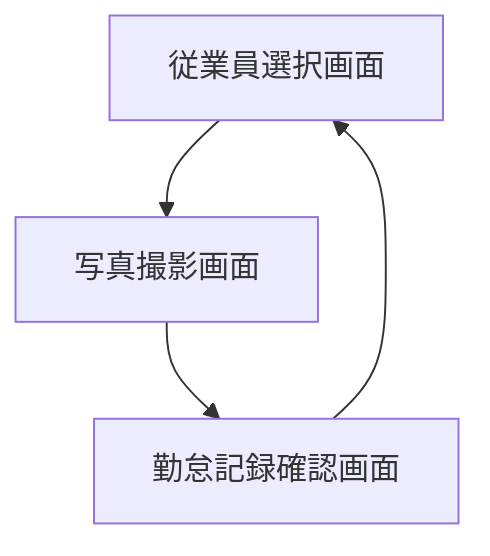
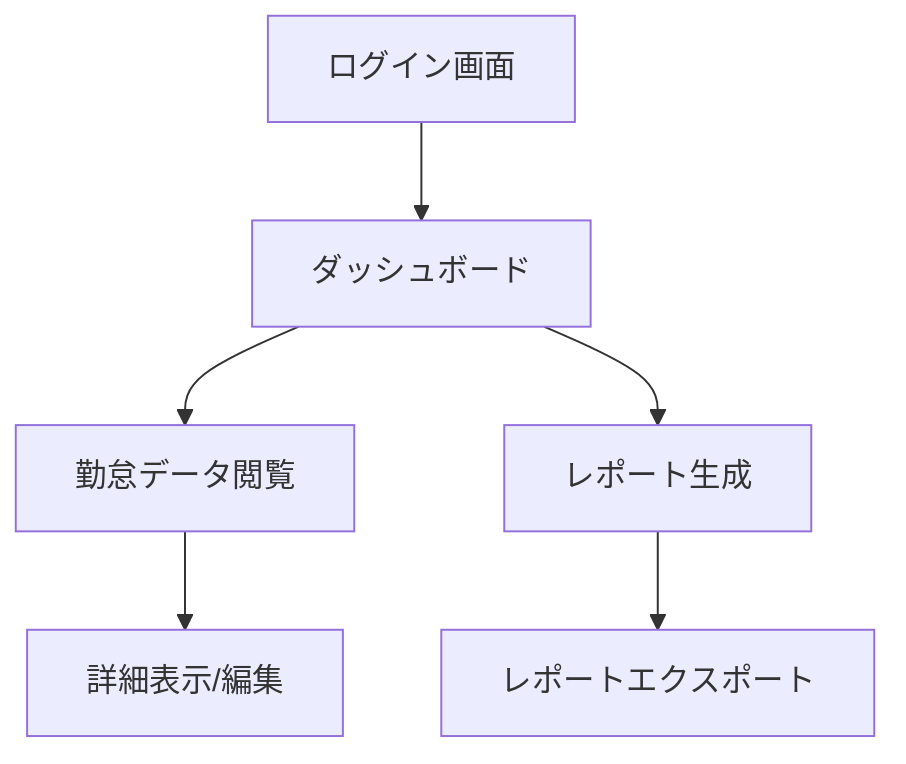

# 勤怠管理システム - デザインレイアウト

## 1. デザインシステム

本システムのデザインはMicrosoftのフルエントデザイン言語を基調とし、透明性、深度、動き、マテリアル感を重視しています。フルエントデザインの特徴である層の概念を取り入れ、ユーザーインターフェースに奥行きと自然な動きを持たせることで、直感的な操作感を実現します。

### カラーパレット

システム全体で一貫したカラースキームを採用し、視認性と操作性を高めます。

#### メインカラー
- **プライマリブルー**: `#0078D4`  - アクションやリンク、重要な要素
- **セカンダリブルー**: `#2B88D8`  - サブアクション、補足情報

#### サブカラー
- **ライトグレー**: `#F3F2F1`  - 背景、非アクティブ要素
- **ダークグレー**: `#323130`  - テキスト、ヘッダー

#### アクセントカラー
- **成功緑**: `#107C10`  - 完了、成功通知
- **警告オレンジ**: `#F2C811`  - 警告、注意喚起
- **エラー赤**: `#D13438`  - エラー、重要警告

#### ニュートラルカラー
- **ホワイト**: `#FFFFFF`  - カード背景、コンテンツエリア
- **ブラック**: `#000000`  - 主要テキスト

### タイポグラフィ設計

フルエントデザインの流暢さを表現するため、軽量感のあるフォントファミリーを採用します。

- 基本フォント: 'Segoe UI', 'Noto Sans JP', sans-serif
- ヘッドライン: 300 weight, 28px（軽量感を強調）
- サブヘッド: 400 weight, 20px
- 本文: 400 weight, 14px
- 小テキスト: 400 weight, 12px
- アイコンフォント: Fluent System Icons

### 主要コンポーネント設計

フルエントデザインの「レイヤー」概念に基づき、UIコンポーネントに深度と透明性を持たせます。

| コンポーネント | フルエントデザイン特性 | 使用場面 |
|-------------|----------------------|--------|
| カード | 微妙な影、角丸、白背景 | 従業員情報、勤怠記録表示 |
| アクションボタン | 浮遊感、ホバー時の深度変化 | 勤怠記録操作 |
| ナビゲーション | サイド配置、アイコン+テキスト | 管理画面セクション切替 |
| カメラUI | 最小限のコントロール、フォーカス領域表示 | 写真撮影時 |
| データテーブル | 行間隔の広いデザイン、行ホバーエフェクト | 勤怠履歴一覧 |
| アクロディオン | スムーズな開閉アニメーション | 詳細情報の表示・非表示 |

## 2. 画面構成と遷移フロー

ビジネス要件のワークフロー図に基づき、2つの主要ワークフローを実装します：従業員の勤怠記録と管理者の業務フロー。フルエントデザインの特徴であるシームレスな遷移を活かし、画面間を自然に移動できる設計とします。

### 従業員の勤怠記録ワークフロー

### 管理者のワークフロー

画面遷移時には、フルエントデザインの特徴である流麗なアニメーションを取り入れ、ユーザーに操作の連続性を感じさせます。特にスライド、フェード、ズームなどの効果を適切に組み合わせて使用します。

## 3. 勤怠記録用画面のデザイン

### メイン画面（従業員選択）

フルエントデザインの特徴である「透明性」と「深度」を活かし、視覚的階層を明確にします。

- ヘッダー部分：半透明のアクリル効果を適用し、現在時刻と日付を大きく表示
- 従業員選択エリア：写真付きカード形式のリスト、各カードはホバー時に微妙に浮き上がる効果
- ナビゲーション：画面下部にアイコン付きコマンドバー

従業員カードはグリッドレイアウトで配置し、タッチ操作でも選択しやすい大きさ（最低120px×120px）で設計します。スクロールが必要な場合は、スムーズなスクロールアニメーションを実装します。

### 写真撮影画面

- カメラビューファインダー：画面中央に大きく配置、フルエントデザインのフレーム効果
- 撮影ボタン：フローティングアクションボタンとして画面下部中央に配置
- キャンセルボタン：左下に配置、前の画面に戻る

カメラアクセス時の遷移はスムーズなアニメーションとし、撮影時はシャッターエフェクトでフィードバックします。撮影後の確認画面ではスワイプ操作で再撮影・確定が行えるデザインとします。

### 勤怠記録確認画面

フルエントデザインの「アクリル」効果を背景に用い、情報の階層を視覚的に表現します。

- 上部：確認メッセージと撮影された写真（カード形式）
- 中央：勤怠情報（日時、勤怠種別）
- 下部：確認ボタンと戻るボタン

確認完了後は、短いセレブレーションアニメーションで操作の完了を示し、自動的に従業員選択画面に戻ります。

## 4. 管理用画面のデザイン特性

管理画面全体にフルエントデザインシステムを適用し、一貫した操作感を提供します。

### ダッシュボード

- サイドナビゲーション：左側に固定、アイコン+テキスト形式
- コマンドバー：上部に配置、主要操作をアイコンボタンで提供
- コンテンツエリア：カード形式でデータを視覚化

データ表示には、フルエントデザインの特徴である「適応性」を活かし、画面サイズに応じてレイアウトが最適化されるレスポンシブデザインを採用します。特に以下の要素を取り入れます：

- インフォグラフィックカード：出勤状況、休暇状況などを視覚的に表示
- リストビュー：現在出勤中の従業員一覧（写真付き）
- アラートバナー：例外データの通知（未退勤者など）

### データ閲覧画面

- フィルターペイン：左側または上部に配置、展開/折りたたみ可能
- データテーブル：行間隔を広めに取り、視認性を高める
- 詳細パネル：右側からスライドイン表示

データ操作時のアニメーションを重視し、ソート、フィルタリング、ページ切替時には適切なトランジション効果を適用します。

### レポート画面

- レポート選択：上部タブまたはピボットで切り替え
- フィルター：コンパクトなコマンドバー内に統合
- データビジュアライズ：フルエントチャートコントロールを使用

グラフや表は印刷を考慮したクリアなデザインとし、エクスポート機能も視認性の高い位置に配置します。

## 5. 共通UI要素と使用体験の統一

### マイクロインタラクション

フルエントデザインの「動き」の要素を活かし、細部にこだわったインタラクションを実装します：

- ボタンホバー時：わずかに浮き上がる効果と色の変化
- リスト項目選択時：なめらかなハイライト効果
- 画面遷移時：コンテンツのスムーズなスライドまたはフェード
- エラー表示時：振動効果を加えた注意喚起

### アクセシビリティへの配慮

フルエントデザインの包括性を活かし、様々なユーザーが使いやすいUIを目指します：

- 高コントラストモード対応
- スクリーンリーダー対応の適切なラベル設定
- キーボードナビゲーション対応
- テキストサイズ調整可能な設計

### 一貫したフィードバック

システム全体で統一されたフィードバックパターンを使用します：

- 成功時：緑色のチェックマークと短い確認メッセージ
- 警告時：オレンジ色の注意アイコンとダイアログ
- エラー時：赤色の通知と対処方法の案内

フルエントデザインの透明性の概念を活用し、システムの状態や反応を視覚的に明示することで、ユーザーに安心感を提供します。 