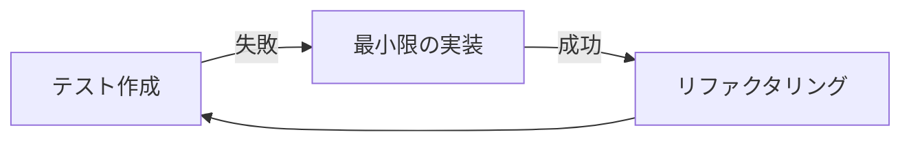

# 勤怠管理システム - 開発ワークフロー

本プロジェクトではテスト駆動開発（TDD）を採用し、品質を担保しながら効率的な開発を実現します。技術スタックの特性を活かした開発プロセスについて説明します。

## 1. 開発の基本原則

### TDD（テスト駆動開発）サイクル

本プロジェクトでは「Red-Green-Refactor」のTDDサイクルを基本とします：

1. **Red**: 失敗するテストを書く
2. **Green**: テストをパスする最小限の実装を行う
3. **Refactor**: コードをリファクタリングする（テストは引き続き成功する状態を維持）



### フィーチャーブランチ戦略

Git操作ルール（`.cursorrules`）に従い、以下のブランチ戦略を採用します：

- `prod`: リリース用ブランチ
- `develop`: 開発用ブランチ
- `feature/*`: 新機能開発ブランチ（developから分岐）
- `fix/*`: バグ修正ブランチ（developから分岐）

## 2. バックエンド開発ワークフロー

### APIエンドポイント開発

1. **テスト定義**: APIの仕様に基づきVitestでテストケースを記述
2. **ルートハンドラ実装**: Honoフレームワークを使用してAPIエンドポイントを実装
3. **データアクセス層実装**: kyselyを使用してCloudflare D1へのクエリを実装
4. **テスト検証**: 単体テストと統合テストで実装を検証
5. **ドキュメント化**: API仕様のドキュメントを更新

```javascript
// 1. テスト定義
test('勤怠記録API: 従業員IDと写真データが与えられたとき、勤怠記録を作成する', async () => {
  // テストコード
});

// 2. ルートハンドラ実装
app.post('/api/attendance', async (c) => {
  // 実装コード
});
```

### データベースマイグレーション

1. **マイグレーションファイル作成**: `wrangler d1 migrations create`でマイグレーションファイルを作成
2. **スキーマ定義**: マイグレーションファイルにテーブル定義を記述
3. **テスト環境適用**: ローカル開発環境でマイグレーションを実行
4. **型定義更新**: kyselyの型定義を更新

## 3. フロントエンド開発ワークフロー

### コンポーネント開発

1. **コンポーネント仕様定義**: 要件に基づきコンポーネントの振る舞いを定義
2. **テスト作成**: Vitestと@testing-library/reactでコンポーネントテストを作成
3. **コンポーネント実装**: shadcn uiとTailwind CSSを使用して実装
4. **VRTテスト**: Playwrightを使用してビジュアルテストを実施
5. **アクセシビリティテスト**: axeなどのツールでアクセシビリティをチェック

```typescript
// 1. コンポーネントテスト
test('カメラコンポーネント: 写真撮影ボタンをクリックするとキャプチャが実行される', async () => {
  // テストコード
});

// 2. コンポーネント実装
const CameraComponent = () => {
  // 実装コード
};
```

### ページ/画面開発

1. **ページ構造設計**: 遷移フローに基づきページ構造を設計
2. **データフェッチング**: APIとの連携部分を実装
3. **レイアウト実装**: フルエントデザインに基づくレイアウトを実装
4. **インタラクション実装**: ユーザー操作に対する反応を実装
5. **E2Eテスト**: Playwrightでエンドツーエンドテストを実施

## 4. CI/CDパイプライン

各開発フェーズは、GitHub Actionsを使用した自動化されたCI/CDパイプラインと連携します：

1. **コミット前チェック**: huskyとlint-stagedによるローカルでの検証
2. **PR作成時**: 自動テスト実行とVRT差分レポート生成
3. **レビュー承認後**: developブランチへのマージ
4. **定期デプロイ**: テスト環境への自動デプロイ
5. **リリース**: prodブランチへのマージとCloudflareへのデプロイ

```yaml
# GitHub Actionsワークフロー例
name: Test and Deploy
on: [pull_request, push]
jobs:
  test:
    # テスト実行
  deploy:
    # デプロイ処理
```

## 5. 具体的な機能開発フロー例

### 勤怠記録機能の開発例

1. **機能要件確認**: ビジネス要件書から勤怠記録の仕様を確認
2. **テスト計画**: 必要なテストケースをリストアップ
3. **feature/attendance-recordブランチ作成**
4. **APIテスト作成**: 勤怠記録APIのテストケースを実装
5. **APIエンドポイント実装**: テストをパスするAPIを実装
6. **フロントエンドテスト作成**: カメラコンポーネントのテストを実装
7. **コンポーネント実装**: テストをパスするコンポーネントを実装
8. **VRTテスト**: ビジュアル検証を実施
9. **E2Eテスト**: 一連のフローをテスト
10. **PRの作成とレビュー**: GitHub CLIを使用してPRを作成
11. **developへのマージ**

## 6. 定例プロセス

### コードレビュー

- PRごとに少なくとも1名のレビューを必須とする
- レビュー観点：
  - テストカバレッジ
  - コード品質
  - ビジネスロジックの正確性
  - パフォーマンス
  - セキュリティ

### 進捗管理

- 毎日のスタンドアップミーティング
- 週次の振り返りと計画
- 2週間のスプリント単位で開発を推進

### ドキュメント更新

- APIの変更は直ちにドキュメントに反映
- コンポーネントの変更はスタイルガイドに反映
- 重要な設計判断はADR（Architecture Decision Record）として記録

## 7. Cloudflareデプロイプロセス

`.cursorrules`で規定されたCloudflareデプロイ手順に従い、以下のプロセスで本番環境への反映を行います：

1. **テスト環境確認**: すべてのテストが成功していることを確認
2. **PR作成**: `develop` → `prod`へのPRを作成
3. **最終レビュー**: 本番投入前の最終確認
4. **ビルド**: `npm run build`でフロントエンド資材をビルド
5. **デプロイ**: `wrangler deploy`でCloudflare Workersにデプロイ
6. **検証**: デプロイ後の動作確認

これらのワークフローを遵守することで、高品質な勤怠管理システムを効率的に開発できます。 