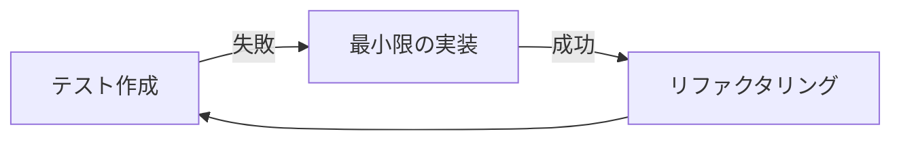

# 勤怠管理モバイルアプリ - 開発ワークフロー

本プロジェクトではテスト駆動開発（TDD）を採用し、品質を担保しながら効率的なモバイルアプリ開発を実現します。Flutterの特性を活かした開発プロセスについて説明します。

## 1. 開発の基本原則

### TDD（テスト駆動開発）サイクル

本プロジェクトでは「Red-Green-Refactor」のTDDサイクルを基本とします：

1. **Red**: 失敗するテストを書く
2. **Green**: テストをパスする最小限の実装を行う
3. **Refactor**: コードをリファクタリングする（テストは引き続き成功する状態を維持）



### フィーチャーブランチ戦略

以下のブランチ戦略を採用します：

- `main`: リリース用ブランチ
- `develop`: 開発用ブランチ
- `feature/*`: 新機能開発ブランチ（developから分岐）
- `fix/*`: バグ修正ブランチ（developから分岐）
- `release/*`: リリース準備用ブランチ

## 2. Flutter開発ワークフロー

### モバイルアプリ開発のライフサイクル

1. **要件分析と設計**: 要件定義、画面設計、アーキテクチャ設計
2. **環境構築**: Flutter開発環境、CI/CD環境の整備
3. **機能開発**: TDDアプローチに基づく実装
4. **テスト**: 単体テスト、ウィジェットテスト、統合テスト
5. **リリース準備**: ストア向けの準備と提出
6. **保守・改善**: 継続的なアップデートとバグ修正

### コード構成

プロジェクトは以下のようなフォルダ構造で整理します：

```
lib/
├── config/           # 環境設定、テーマ、定数
│   └── environment.dart  # 環境設定
├── data/
│   ├── models/       # データモデル
│   ├── repositories/ # リポジトリ実装
│   └── services/     # APIサービス
├── domain/
│   ├── entities/     # ドメインエンティティ
│   └── repositories/ # リポジトリインターフェース
├── presentation/
│   ├── pages/        # 画面
│   ├── widgets/      # 再利用可能なウィジェット
│   └── providers/    # 状態管理プロバイダー
├── utils/            # ユーティリティ関数
└── main.dart         # エントリーポイント
```

## 3. フィーチャー開発ワークフロー

### 新機能の開発フロー

1. **フィーチャーブランチの作成**:
   ```bash
   git checkout develop
   git pull
   git checkout -b feature/login-screen
   ```

2. **モデルの作成**: データ構造とビジネスロジックの定義
   ```dart
   // lib/data/models/attendance_record.dart
   class AttendanceRecord {
     final String id;
     final DateTime timestamp;
     final AttendanceType type;
     final String photoUrl;
     
     // コンストラクタ、JSONシリアライズなど
   }
   ```

3. **テストの作成**: 機能のテストケースを先に作成
   ```dart
   // test/services/attendance_service_test.dart
   test('出勤記録が正しく作成される', () async {
     // テストコード
   });
   ```

4. **サービス層の実装**: APIと連携する機能を実装
   ```dart
   // lib/data/services/attendance_service.dart
   class AttendanceService {
     Future<Result<AttendanceRecord>> recordAttendance({
       required AttendanceType type,
       required String photoData,
     }) async {
       // 実装
     }
   }
   ```

5. **UIの設計と実装**: 画面とウィジェットの実装
   ```dart
   // lib/presentation/pages/attendance_record_page.dart
   class AttendanceRecordPage extends StatelessWidget {
     // 実装
   }
   ```

6. **状態管理の実装**: Riverpodを使った状態管理
   ```dart
   // lib/presentation/providers/attendance_provider.dart
   final attendanceProvider = StateNotifierProvider<AttendanceNotifier, AttendanceState>((ref) {
     return AttendanceNotifier(ref.read(attendanceServiceProvider));
   });
   ```

7. **ウィジェットテスト**: UIの動作確認
   ```dart
   // test/pages/attendance_record_page_test.dart
   testWidgets('カメラボタンをタップすると写真撮影画面が表示される', (tester) async {
     // テストコード
   });
   ```

8. **統合テスト**: 一連のフローを実機/エミュレータでテスト
   ```dart
   // integration_test/app_test.dart
   testWidgets('出勤記録の完全フロー', (tester) async {
     // テストコード
   });
   ```

9. **コードレビュー**: PRを作成し、レビューを依頼
   ```bash
   git add .
   git commit -m "Add attendance record feature"
   git push origin feature/login-screen
   # GitHub上でPRを作成
   ```

10. **マージ**: レビュー承認後、developブランチにマージ

## 4. モバイル固有の開発ポイント

### クロスプラットフォーム対応

以下の点に注意して両プラットフォーム（iOS/Android）で一貫した体験を提供します：

1. **プラットフォーム固有のコード**: Platform.isIOSなどで条件分岐
   ```dart
   if (Platform.isIOS) {
     // iOS固有の処理
   } else if (Platform.isAndroid) {
     // Android固有の処理
   }
   ```

2. **ネイティブ機能へのアクセス**: カメラ、位置情報などのプラットフォーム機能へのアクセス方法
   ```dart
   // カメラアクセス例
   final cameras = await availableCameras();
   final camera = cameras.first;
   final controller = CameraController(camera, ResolutionPreset.high);
   await controller.initialize();
   ```

3. **パーミッション処理**: 必要な権限の要求と管理
   ```dart
   // permission_handler パッケージ使用例
   if (await Permission.camera.request().isGranted) {
     // カメラ使用可能
   } else {
     // 権限がないケースの処理
   }
   ```

### ローカルデータ管理

1. **オフライン対応**: Hiveを使ったローカルデータベース
   ```dart
   final box = await Hive.openBox<AttendanceRecord>('attendance_records');
   // データ保存
   await box.add(record);
   // データ取得
   final records = box.values.toList();
   ```

2. **データ同期**: バックエンドとデータを同期
   ```dart
   Future<void> syncAttendanceRecords() async {
     final localRecords = getUnsyncedRecordsFromLocal();
     for (final record in localRecords) {
       await apiClient.uploadRecord(record);
       await markRecordAsSynced(record);
     }
   }
   ```

## 5. リリースワークフロー

### ビルドバリアントとフレーバー

開発、ステージング、本番環境ごとに異なる設定を使用します：

1. **環境ごとの設定ファイル**:
   ```dart
   // lib/config/environment.dart
   enum Environment { development, staging, production }
   
   class AppConfig {
     final Environment env;
     final String apiUrl;
     // その他の設定
   }
   ```

2. **フレーバーごとのビルド**:
   ```bash
   # 開発環境向けビルド
   flutter run --flavor development --target lib/main_development.dart
   
   # 本番環境向けビルド
   flutter run --flavor production --target lib/main_production.dart
   ```

### リリース準備

1. **バージョン管理**: pubspec.yamlのバージョン番号を更新
   ```yaml
   version: 1.0.0+1  # バージョン名+ビルド番号
   ```

2. **リリースブランチ作成**:
   ```bash
   git checkout develop
   git checkout -b release/v1.0.0
   # 必要なリリース前の修正を実施
   ```

3. **リリースビルド**:
   ```bash
   # Android AAB生成
   flutter build appbundle --flavor production --target lib/main_production.dart
   
   # iOS アーカイブ作成
   flutter build ipa --flavor production --target lib/main_production.dart
   ```

4. **ストア提出準備**:
   - Android: Google Play Console
   - iOS: App Store Connect

## 6. CI/CD パイプライン

### 自動化ワークフロー

GitHub Actionsを使用して以下のプロセスを自動化します：

1. **プルリクエスト時**:
   - コード解析（flutter analyze）
   - 単体テスト（flutter test）
   - ウィジェットテスト

2. **developへのマージ時**:
   - 上記に加えて統合テスト
   - ステージング環境へのデプロイ
   - Firebase App Distributionで内部テスター向け配布

3. **mainへのマージ時**:
   - リリースビルド
   - App Store ConnectとGoogle Play Consoleへの自動提出

### GitHub Actions設定例

```yaml
name: Flutter CI

on:
  push:
    branches: [ develop, main ]
  pull_request:
    branches: [ develop ]

jobs:
  build:
    runs-on: ubuntu-latest
    steps:
    - uses: actions/checkout@v3
    - uses: subosito/flutter-action@v2
      with:
        flutter-version: '3.10.0'
        channel: 'stable'
    - run: flutter pub get
    - run: flutter analyze
    - run: flutter test
    - run: flutter build apk --flavor development
    # その他のステップ...
```

## 7. プロジェクト管理と進捗追跡

### 作業管理

1. **タスク管理**: GitHub Issues または Jira などのタスク管理ツール
2. **スプリント計画**: 2週間単位のスプリント
3. **デイリースタンドアップ**: 毎日の進捗確認と課題共有

### ドキュメント管理

1. **API仕様書**: バックエンドAPIのインターフェース定義
2. **アーキテクチャ文書**: システム設計とパターンの記録
3. **UI/UXガイドライン**: デザインシステムとコンポーネント定義

以上のワークフローを遵守することで、高品質なFlutterモバイルアプリケーションを効率的に開発することができます。 
# 勤怠管理システム - 開発ワークフロー

本プロジェクトではテスト駆動開発（TDD）を採用し、品質を担保しながら効率的な開発を実現します。技術スタックの特性を活かした開発プロセスについて説明します。

## 1. 開発の基本原則

### TDD（テスト駆動開発）サイクル

本プロジェクトでは「Red-Green-Refactor」のTDDサイクルを基本とします：

1. **Red**: 失敗するテストを書く
2. **Green**: テストをパスする最小限の実装を行う
3. **Refactor**: コードをリファクタリングする（テストは引き続き成功する状態を維持）


### フィーチャーブランチ戦略

Git操作ルール（`.cursorrules`）に従い、以下のブランチ戦略を採用します：

- `prod`: リリース用ブランチ
- `develop`: 開発用ブランチ
- `feature/*`: 新機能開発ブランチ（developから分岐）
- `fix/*`: バグ修正ブランチ（developから分岐）

## 2. バックエンド開発ワークフロー

### APIエンドポイント開発

1. **テスト定義**: APIの仕様に基づきVitestでテストケースを記述
2. **ルートハンドラ実装**: Honoフレームワークを使用してAPIエンドポイントを実装
3. **データアクセス層実装**: kyselyを使用してCloudflare D1へのクエリを実装
4. **テスト検証**: 単体テストと統合テストで実装を検証
5. **ドキュメント化**: API仕様のドキュメントを更新

```javascript
// 1. テスト定義
test('勤怠記録API: 従業員IDと写真データが与えられたとき、勤怠記録を作成する', async () => {
  // テストコード
});

// 2. ルートハンドラ実装
app.post('/api/attendance', async (c) => {
  // 実装コード
});
```

### データベースマイグレーション

1. **マイグレーションファイル作成**: `wrangler d1 migrations create`でマイグレーションファイルを作成
2. **スキーマ定義**: マイグレーションファイルにテーブル定義を記述
3. **テスト環境適用**: ローカル開発環境でマイグレーションを実行
4. **型定義更新**: kyselyの型定義を更新

## 3. フロントエンド開発ワークフロー

### コンポーネント開発

1. **コンポーネント仕様定義**: 要件に基づきコンポーネントの振る舞いを定義
2. **テスト作成**: Vitestと@testing-library/reactでコンポーネントテストを作成
3. **コンポーネント実装**: shadcn uiとTailwind CSSを使用して実装
4. **VRTテスト**: Playwrightを使用してビジュアルテストを実施
5. **アクセシビリティテスト**: axeなどのツールでアクセシビリティをチェック

```typescript
// 1. コンポーネントテスト
test('カメラコンポーネント: 写真撮影ボタンをクリックするとキャプチャが実行される', async () => {
  // テストコード
});

// 2. コンポーネント実装
const CameraComponent = () => {
  // 実装コード
};
```

### ページ/画面開発

1. **ページ構造設計**: 遷移フローに基づきページ構造を設計
2. **データフェッチング**: APIとの連携部分を実装
3. **レイアウト実装**: フルエントデザインに基づくレイアウトを実装
4. **インタラクション実装**: ユーザー操作に対する反応を実装
5. **E2Eテスト**: Playwrightでエンドツーエンドテストを実施

## 4. CI/CDパイプライン

各開発フェーズは、GitHub Actionsを使用した自動化されたCI/CDパイプラインと連携します：

1. **コミット前チェック**: huskyとlint-stagedによるローカルでの検証
2. **PR作成時**: 自動テスト実行とVRT差分レポート生成
3. **レビュー承認後**: developブランチへのマージ
4. **定期デプロイ**: テスト環境への自動デプロイ
5. **リリース**: prodブランチへのマージとCloudflareへのデプロイ

```yaml
# GitHub Actionsワークフロー例
name: Test and Deploy
on: [pull_request, push]
jobs:
  test:
    # テスト実行
  deploy:
    # デプロイ処理
```

## 5. 具体的な機能開発フロー例

### 勤怠記録機能の開発例

1. **機能要件確認**: ビジネス要件書から勤怠記録の仕様を確認
2. **テスト計画**: 必要なテストケースをリストアップ
3. **feature/attendance-recordブランチ作成**
4. **APIテスト作成**: 勤怠記録APIのテストケースを実装
5. **APIエンドポイント実装**: テストをパスするAPIを実装
6. **フロントエンドテスト作成**: カメラコンポーネントのテストを実装
7. **コンポーネント実装**: テストをパスするコンポーネントを実装
8. **VRTテスト**: ビジュアル検証を実施
9. **E2Eテスト**: 一連のフローをテスト
10. **PRの作成とレビュー**: GitHub CLIを使用してPRを作成
11. **developへのマージ**

## 6. 定例プロセス

### コードレビュー

- PRごとに少なくとも1名のレビューを必須とする
- レビュー観点：
  - テストカバレッジ
  - コード品質
  - ビジネスロジックの正確性
  - パフォーマンス
  - セキュリティ

### 進捗管理

- 毎日のスタンドアップミーティング
- 週次の振り返りと計画
- 2週間のスプリント単位で開発を推進

### ドキュメント更新

- APIの変更は直ちにドキュメントに反映
- コンポーネントの変更はスタイルガイドに反映
- 重要な設計判断はADR（Architecture Decision Record）として記録

## 7. Cloudflareデプロイプロセス

`.cursorrules`で規定されたCloudflareデプロイ手順に従い、以下のプロセスで本番環境への反映を行います：

1. **テスト環境確認**: すべてのテストが成功していることを確認
2. **PR作成**: `develop` → `prod`へのPRを作成
3. **最終レビュー**: 本番投入前の最終確認
4. **ビルド**: `npm run build`でフロントエンド資材をビルド
5. **デプロイ**: `wrangler deploy`でCloudflare Workersにデプロイ
6. **検証**: デプロイ後の動作確認

これらのワークフローを遵守することで、高品質な勤怠管理システムを効率的に開発できます。 