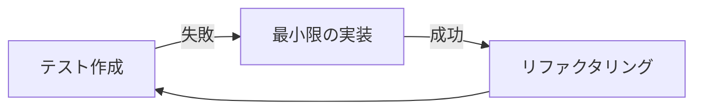

# 勤怠管理モバイルアプリ - 開発ワークフロー

本プロジェクトではテスト駆動開発（TDD）を採用し、品質を担保しながら効率的なモバイルアプリ開発を実現します。Flutterの特性を活かした開発プロセスと共有端末としての考慮点について説明します。

## 1. 開発の基本原則

### TDD（テスト駆動開発）サイクル

本プロジェクトでは「Red-Green-Refactor」のTDDサイクルを基本とします：

1. **Red**: 失敗するテストを書く
2. **Green**: テストをパスする最小限の実装を行う
3. **Refactor**: コードをリファクタリングする（テストは引き続き成功する状態を維持）



### フィーチャーブランチ戦略

以下のブランチ戦略を採用します：

- `main`: リリース用ブランチ
- `develop`: 開発用ブランチ
- `feature/*`: 新機能開発ブランチ（developから分岐）
- `fix/*`: バグ修正ブランチ（developから分岐）
- `release/*`: リリース準備用ブランチ

## 2. Flutter開発ワークフロー

### モバイルアプリ開発のライフサイクル

1. **要件分析と設計**: 要件定義、画面設計、アーキテクチャ設計
2. **環境構築**: Flutter開発環境、CI/CD環境、テスト端末の整備
3. **機能開発**: TDDアプローチに基づく実装
4. **テスト**: 単体テスト、ウィジェットテスト、統合テスト、端末耐久性テスト
5. **展開準備**: 端末設定とプロビジョニング
6. **保守・改善**: 継続的なアップデートとモニタリング

### コード構成

プロジェクトは以下のようなフォルダ構造で整理します：

```
lib/
├── config/           # 環境設定、テーマ、定数
│   └── environment.dart  # 環境設定
├── data/
│   ├── models/       # データモデル
│   ├── repositories/ # リポジトリ実装
│   └── services/     # APIサービス
├── domain/
│   ├── entities/     # ドメインエンティティ
│   └── repositories/ # リポジトリインターフェース
├── presentation/
│   ├── pages/        # 画面
│   ├── widgets/      # 再利用可能なウィジェット
│   └── providers/    # 状態管理プロバイダー
├── device/           # 共有端末特有の機能
│   ├── kiosk/        # キオスクモード制御
│   ├── hardware/     # ハードウェアアクセス
│   └── monitoring/   # 端末モニタリング
├── utils/            # ユーティリティ関数
└── main.dart         # エントリーポイント
```

## 3. フィーチャー開発ワークフロー

### 新機能の開発フロー

1. **フィーチャーブランチの作成**:
   ```bash
   git checkout develop
   git pull
   git checkout -b feature/employee-selection
   ```

2. **モデルの作成**: データ構造とビジネスロジックの定義
   ```dart
   // lib/data/models/employee.dart
   class Employee {
     final String id;
     final String name;
     final String department;
     final String? photoUrl;
     
     // コンストラクタ、JSONシリアライズなど
   }
   ```

3. **テストの作成**: 機能のテストケースを先に作成
   ```dart
   // test/services/employee_service_test.dart
   test('従業員一覧が正しく取得できる', () async {
     // テストコード
   });
   ```

4. **サービス層の実装**: APIと連携する機能を実装
   ```dart
   // lib/data/services/employee_service.dart
   class EmployeeService {
     Future<Result<List<Employee>>> getEmployees() async {
       // 実装
     }
   }
   ```

5. **UIの設計と実装**: 画面とウィジェットの実装
   ```dart
   // lib/presentation/pages/employee_selection_page.dart
   class EmployeeSelectionPage extends StatelessWidget {
     // 実装
   }
   ```

6. **状態管理の実装**: Riverpodを使った状態管理
   ```dart
   // lib/presentation/providers/employee_provider.dart
   final employeeProvider = StateNotifierProvider<EmployeeNotifier, EmployeeState>((ref) {
     return EmployeeNotifier(ref.read(employeeServiceProvider));
   });
   ```

7. **ウィジェットテスト**: UIの動作確認
   ```dart
   // test/pages/employee_selection_page_test.dart
   testWidgets('従業員カードをタップすると勤怠種別選択画面に遷移する', (tester) async {
     // テストコード
   });
   ```

8. **統合テスト**: 一連のフローを実機/エミュレータでテスト
   ```dart
   // integration_test/app_test.dart
   testWidgets('従業員選択から打刻完了までの一連の流れ', (tester) async {
     // テストコード
   });
   ```

9. **コードレビュー**: PRを作成し、レビューを依頼
   ```bash
   git add .
   git commit -m "Add employee selection feature"
   git push origin feature/employee-selection
   # GitHub上でPRを作成
   ```

10. **マージ**: レビュー承認後、developブランチにマージ

## 4. 共有端末特有の開発ポイント

### キオスクモード実装

共有端末として常時稼働するためのキオスクモード機能実装：

1. **画面常時表示の実装**:
   ```dart
   // lib/device/kiosk/screen_manager.dart
   class ScreenManager {
     Future<void> keepScreenOn() async {
       await Wakelock.enable();
     }
     
     Future<void> enterKioskMode() async {
       if (Platform.isAndroid) {
         await FlutterKioskMode.enterKioskMode();
       } else if (Platform.isIOS) {
         // iOS向けのガイドアクセスモード指示表示
       }
     }
   }
   ```

2. **ハードウェアボタン制御**:
   ```dart
   // Android向けにシステムUIの無効化（オプション）
   @override
   void initState() {
     super.initState();
     if (Platform.isAndroid) {
       SystemChrome.setEnabledSystemUIMode(
         SystemUiMode.immersiveSticky,
       );
     }
   }
   ```

3. **自動復帰機能**:
   ```dart
   // アプリが異常終了した場合の自動再起動
   // AndroidManifest.xmlに設定
   // <application
   //   android:name=".MainApplication"
   //   ...
   //   android:persistent="true">
   ```

### 端末識別と拠点管理

複数端末での展開を考慮した設計：

1. **端末識別子の生成と保存**:
   ```dart
   // lib/device/hardware/device_identifier.dart
   class DeviceIdentifier {
     Future<String> getOrCreateDeviceId() async {
       final storage = FlutterSecureStorage();
       String? deviceId = await storage.read(key: 'device_id');
       
       if (deviceId == null) {
         deviceId = Uuid().v4(); // 新しいUUID生成
         await storage.write(key: 'device_id', value: deviceId);
       }
       
       return deviceId;
     }
   }
   ```

2. **拠点情報の管理**:
   ```dart
   // lib/data/services/location_service.dart
   class LocationService {
     Future<void> registerDeviceToLocation({
       required String deviceId,
       required String locationId,
       required String locationName,
     }) async {
       // APIへの登録処理
     }
     
     Future<LocationInfo?> getLocationInfo(String deviceId) async {
       // デバイスに紐づく拠点情報取得
     }
   }
   ```

## 5. 端末展開ワークフロー

### 拠点ごとの端末設定

拠点への端末展開時の設定フロー：

1. **端末の初期セットアップ**:
   ```
   1. 端末のOS設定（言語、時刻など）
   2. アプリのインストール
   3. 管理者モードで拠点情報を設定
   4. 端末IDと拠点IDの紐付け
   5. キオスクモードの有効化
   ```

2. **設定の自動化**:
   ```bash
   # Android向け自動設定スクリプト例
   adb shell settings put global stay_on_while_plugged_in 7
   adb shell am start -n com.example.attendance/com.example.attendance.MainActivity
   # その他の設定コマンド
   ```

3. **MDM（Mobile Device Management）連携**:
   ```
   1. Android Enterprise / Apple Business Manager への登録
   2. 企業所有の専用デバイスとして登録
   3. キオスクポリシーの適用
   4. アプリの自動更新設定
   ```

### リモート管理と監視

展開後の端末管理フロー：

1. **リモートモニタリング**:
   ```dart
   // lib/device/monitoring/health_reporter.dart
   class HealthReporter {
     // 定期的な状態報告
     void startPeriodicReporting() {
       Timer.periodic(Duration(hours: 1), (_) {
         reportDeviceStatus();
       });
     }
     
     Future<void> reportDeviceStatus() async {
       final status = await DeviceStatus.collect();
       await apiClient.reportStatus(status);
     }
   }
   ```

2. **リモート設定変更**:
   ```dart
   // Firebase Remote Configを使った設定管理
   final remoteConfig = FirebaseRemoteConfig.instance;
   await remoteConfig.setConfigSettings(
     RemoteConfigSettings(
       fetchTimeout: Duration(minutes: 1),
       minimumFetchInterval: Duration(hours: 12),
     ),
   );
   await remoteConfig.fetchAndActivate();
   final syncInterval = remoteConfig.getInt('sync_interval_minutes');
   ```

## 6. CI/CD パイプライン

### 自動化ワークフロー

GitHub Actionsを使用して以下のプロセスを自動化します：

1. **プルリクエスト時**:
   - コード解析（flutter analyze）
   - 単体テスト（flutter test）
   - ウィジェットテスト

2. **developへのマージ時**:
   - 上記に加えて統合テスト
   - テスト用APK/IPAのビルド
   - テスト端末への展開

3. **mainへのマージ時**:
   - リリースビルド
   - MDMシステムへの登録

### GitHub Actions設定例

```yaml
name: Flutter CI

on:
  push:
    branches: [ develop, main ]
  pull_request:
    branches: [ develop ]

jobs:
  build:
    runs-on: ubuntu-latest
    steps:
    - uses: actions/checkout@v3
    - uses: subosito/flutter-action@v2
      with:
        flutter-version: '3.10.0'
        channel: 'stable'
    - run: flutter pub get
    - run: flutter analyze
    - run: flutter test
    - run: flutter build apk --flavor development --debug
    # その他のステップ...
```

## 7. トラブルシューティングとメンテナンス

### 端末問題の対応フロー

現場で発生した問題への対応手順：

1. **問題の切り分け**:
   ```
   1. アプリの問題か、端末の問題か、ネットワークの問題かを判断
   2. アプリログの収集
   3. 環境情報（OS、アプリバージョン、ネットワーク状態）の収集
   ```

2. **リモート診断**:
   ```dart
   // lib/device/monitoring/diagnostics.dart
   class DiagnosticsService {
     Future<DiagnosticsReport> runDiagnostics() async {
       final report = DiagnosticsReport(
         appVersion: await PackageInfo.fromPlatform().then((p) => p.version),
         deviceInfo: await DeviceInfoPlugin().androidInfo,
         networkStatus: await Connectivity().checkConnectivity(),
         storageStatus: await checkStorageStatus(),
         lastSyncTime: await getLastSyncTime(),
         // その他の診断情報
       );
       return report;
     }
   }
   ```

3. **OTAアップデート**:
   ```
   1. 問題修正を含むアップデートのビルド
   2. MDMを通じたアップデート配信
   3. アップデート適用の監視
   ```

### 定期メンテナンス

端末の安定稼働のための定期メンテナンス手順：

1. **清掃と物理チェック**:
   ```
   1. 画面表面の清掃
   2. 電源接続の確認
   3. 物理的な損傷チェック
   ```

2. **データクリーンアップ**:
   ```dart
   // lib/device/maintenance/clean_up.dart
   class MaintenanceService {
     Future<void> performScheduledMaintenance() async {
       // 古いログの削除
       await cleanupOldLogs();
       
       // キャッシュの整理
       await cleanupCache();
       
       // 同期済みオフラインデータの削除
       await removeProcessedOfflineData();
     }
   }
   ```

3. **ソフトウェア更新**:
   ```
   1. OSアップデートの適用（必要に応じて）
   2. アプリのアップデート
   3. 設定の再確認
   ```

この開発ワークフローにより、共有端末として安定して動作する高品質な勤怠管理モバイルアプリケーションを効率的に開発・展開・運用することができます。 